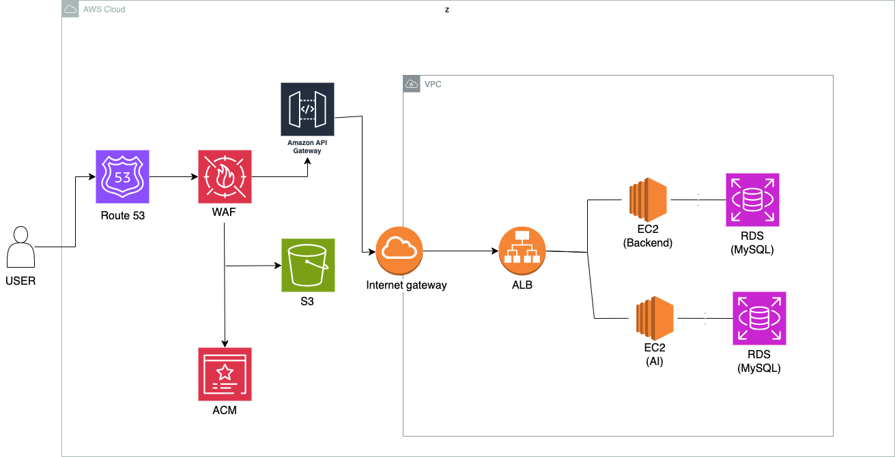

<!-- Template for PROJECT REPORT of CapstoneDesign 2025-2H, initially written by khyoo -->
<!-- 본 파일은 2025년도 컴공 졸업프로젝트의 <1차보고서> 작성을 위한 기본 양식입니다. -->
<!-- 아래에 "*"..."*" 표시는 italic체로 출력하기 위해서 사용한 것입니다. -->
<!-- "내용"에 해당하는 부분을 지우고, 여러분 과제의 내용을 작성해 주세요. -->

# Team-Info
| (1) 과제명 | *본인 팀에서 수행중인 프로젝트의 이름을 작성합니다*
|:---  |---  |
| (2) 팀 번호 / 팀 이름 | *팀ID-팀이름* |
| (3) 팀 구성원 | 홍길동 (0000000): 리더, *맡은 역할*   김팀원 (0000000): 팀원, *맡은 역할*   이멤버 (0000000) : 팀원, *맡은 역할*			 |
| (4) 팀 지도교수 | OOO 교수님 |
| (5) 과제 분류 | *산학과제 or 연구 과제* |
| (6) 과제 키워드 | *과제관련 키워드 (3~5개 정도)*  |
| (7) 과제 내용 요약 | *전체 과제 내용을 10줄이내로 설명* |

 

# Project-Summary
| 항목 | 내용 |
|:---  |---  |
| (1) 문제 정의 | *본 과제를 통하여 해결/완화하고자하는 문제에 대하여 기술. Target Customer 정의와 해결해야 할 문제점들(pain points)대한 내용 기술*  |
| (2) 기존연구와의 비교 | *유사한 과제/연구/서비스/시스템의 예를 들고, 각각의 장단점을 기술할 것. 특히, 본 과제가 유사과제에 대하여 갖는 장점을 부각할 것* |
| (3) 제안 내용 | *본 프로젝트에서 제시한 문제를 해결하기 위해 새롭제 제안하는 해결책 or 해결책들에 대하여 기술 .* |
| (4) 기대효과 및 의의 | *프로젝트의 결과물을 통하여 얻을 수 있는 기대효과 및 의의에 대하여 기술 .* |
| (5) 주요 기능 리스트 | *(3)에서 제안한 해결책들을 지원or구현하기 위하여 필요한 주요 기능 혹은 기능을을 List-up하고,   각각에 대하여 설명*   * 본 항목의 내용을 충실히 기재 바람니다. *|

 
 
# Project-Design & Implementation
| 항목 | 내용 |
|:---  |---  |
| (1) 요구사항 정의 | *프로젝트를 완성하기 위해 필요한 요구사항을 설명하기에 가장 적합한 방법을 선택하여 기술*   예)   - 기능별 상세 요구사항(또는 유스케이스)   - 설계 모델(클래스 다이어그램, 클래스 및 모듈 명세서)   - UI 분석/설계 모델   - E-R 다이어그램/DB 설계 모델(테이블 구조) |
| (2) 전체 시스템 구성 | *프로젝트를 위하여, SW 전체 시스템의 구조를 보인다. (가능하다면, 사용자도 포함)   주요 SW 모듈을 보이고, 각각의 역할을 기술한다.  만약, 오픈소스 혹은 외부 모듈을 사용한다면 이또한 기술한다.*  **Memoir - SW 전체 시스템 구성도**  **시스템 구성도**: |
| (3) 주요엔진 및 기능 설계 | *프로젝트의 주요 기능 혹은 모듈의 설계내용에 대하여 기술한다   SW 구조 그림에 있는 각 Module의 상세 구현내용을 자세히 기술한다.* ### 사용자 (User)

- **역할**: 웹 인터페이스를 통해 서비스를 사용
- **사용자 행동 흐름**
  - 전시 탐색
  - 감상 리뷰 작성
  - 사진 업로드
  - 굿즈 생성 요청

---

### Frontend (웹 - React)

- **역할**: 사용자 UI 제공 및 Backend API와 통신
- **기능 설계**
  - 전시 검색 UI
  - 리뷰 작성/수정/조회 UI
  - 파일 업로드 컴포넌트
  - 굿즈 생성 버튼 + 결과 이미지 확인
  - 로그인/회원가입 처리
- **기술 스택**
  - React
  - 상태 관리: Context API / Redux
  - Axios 또는 Fetch API

---

###  Backend API 서버 (EC2)

- **역할**: 비즈니스 로직 처리, DB 및 AI API 연동
- **핵심 모듈**
  - `Auth`: JWT 기반 인증
  - `Exhibition`: 전시 정보 CRUD 및 검색
  - `Review`: 리뷰 작성, 수정, 삭제, 조회
  - `Upload`: S3 이미지 업로드 핸들링
  - `AI`: StyleShot API와 통신
- **기술 스택**
  - Django / FastAPI / Node.js 등
  - PostgreSQL ORM
  - AWS SDK (S3 연동)

---

###  RDS (PostgreSQL)

- **역할**: 핵심 데이터 저장소
- **DB 테이블 예시**
  - `User`: 사용자 정보
  - `Exhibition`: 전시 정보 (제목, 장소, 날짜 등)
  - `Review`: 감상평, 이미지, 태그 등
  - `Goods`: 생성된 굿즈 정보 (AI 결과 이미지 URL 등)

---

### StyleShot AI 모델 API 호출

- **역할**: Style Transfer 기반 굿즈 이미지 생성
- **기능 설계**
  - 사용자 이미지 + 전시 스타일 정보 전달
  - 생성 이미지 수신 (URL 또는 파일)
  - 결과 이미지 메타데이터 DB 저장
- **예상 방식**
  - 외부 REST API 호출
  - JSON + multipart 업로드, 결과 이미지 URL 반환

---

### S3 (이미지 스토리지)

- **역할**: 전시 사진 및 생성된 티켓 굿즈 이미지 저장
- **기능 설계**
  - Presigned URL 방식 이미지 업로드
  - 저장된 이미지 URL → DB 저장
  - 정적 리소스로 사용자에게 공개 |
| (4) 주요 기능의 구현 | *<주요기능리스트>에 정의된 기능 중 최소 2개 이상에 대한 상세 구현내용을 기술한다.* |
| (5) 기타 | *기타 사항을 기술*  |

 
